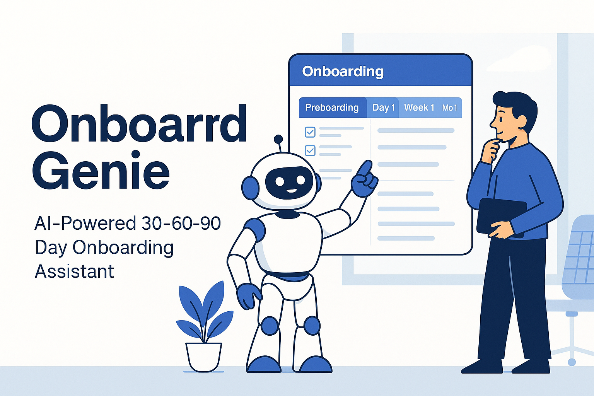

# 🌟 OnboardGenie – AI-Powered 30-60-90 Day Onboarding Assistant

**OnboardGenie** is an AI-powered HR assistant that generates expert, structured **30-60-90 day onboarding plans** for new hires.
It combines a **Python FastAPI backend** with an **IBM watsonx Orchestrate agent** to deliver an end-to-end onboarding experience:

* Preboarding → Day 1 → Week 1 → Month 1 → Month 2 → Month 3
* Detailed tasks for HR, IT, the manager, and the new employee
* Personalized welcome email
* Manager briefing (focus points for 30/60/90 days)
* Learning path for the first three months

Built for the IBM AI Hackathon, this project showcases how **LLMs + orchestration** can automate and standardize onboarding at enterprise scale.

---
## 🎥 **OnboardGenie – Demo Video** :
[](video1327262728.mp4)

---

## 🚀 Key Features

### 🔹 Structured 30-60-90 day onboarding plan

Includes phases, tasks, channels, owners, deadlines, and workflows.

### 🔹 Personalized Welcome Email

Automatically tailored to the employee’s name, role, start date, and team.

### 🔹 Manager Briefing

Clear focus areas for the manager at 30, 60, and 90 days.

### 🔹 Learning Path (3 Months)

Technical, organizational, and role-based learning progression.

### 🔹 Production-Ready Backend

FastAPI backend deployed publicly on Render, consumed by the Orchestrate tool.

### 🔹 Enterprise Orchestration

IBM watsonx Orchestrate agent:

* Calls the backend tool
* Formats the result
* Generates summaries, translations, adjustments
* Supports follow-up instructions

---

## 🧱 Architecture Overview

### **1. FastAPI Backend (OnboardGenie API)**

* Endpoint: `POST /onboarding/plan`
* Inputs → Employee context
* Output → A full `OnboardingPlanResponse`
* Hosted on Render:
  👉 **[https://onboardgenie-api.onrender.com](https://onboardgenie-api.onrender.com/docs)**

### **2. OpenAPI Specification (`onboardgenie.yaml`)**

Defines:

* Request schema (`OnboardingRequest`)
* Response schema (`OnboardingPlanResponse`)
* Endpoint mapping
  Imported into Orchestrate as **GenerateOnboardingPlan**.

### **3. IBM watsonx Orchestrate Agent**

* Name: **OnboardGenie**
* Model: `llama-3-2-90b-vision-instruct` (or equivalent)
* Behavior:

  * Always call the tool to generate onboarding plans
  * Provide summaries, translations, and adjustments
  * Adapt tone based on HR, manager, or employee

### **Architecture Diagram**

```
                      ┌──────────────────────────┐
                      │     HR / Manager User     │
                      └──────────────┬────────────┘
                                     │
                                     ▼
                        ┌─────────────────────────┐
                        │ IBM Orchestrate Chat UI │
                        │   Agent: OnboardGenie   │
                        └────────────┬────────────┘
                                     │ Tool Call
                                     ▼
                 ┌──────────────────────────────────────┐
                 │  GenerateOnboardingPlan (OpenAPI)    │
                 └──────────────────────────────────────┘
                                     │
                                     ▼
                     ┌──────────────────────────────────┐
                     │ FastAPI Backend (Render Hosting) │
                     │       POST /onboarding/plan       │
                     └──────────────────────────────────┘
                                     │
                                     ▼
                     ┌──────────────────────────────────┐
                     │  Structured 30-60-90 Day Plan     │
                     │  JSON + Emails + Tasks + Path     │
                     └──────────────────────────────────┘
```

---

## 🛠 Tech Stack

**Backend**

* Python 3
* FastAPI
* Uvicorn
* Pydantic

**Deployment**

* Render (public hosting)

**AI / Orchestration**

* IBM watsonx Orchestrate
* Llama-3 / Watsonx GenAI
* OpenAPI 3.0.3 tool integration

---

## 📡 API – OnboardGenie Backend

### Base URL

```
https://onboardgenie-api.onrender.com
```

### Endpoint

#### `POST /onboarding/plan`

Example Request:

```json
{
  "employeeName": "Mina Atm",
  "role": "AI developer",
  "department": "IA/ML",
  "startDate": "2025-12-12",
  "level": "junior",
  "location": "France",
  "workMode": "hybrid",
  "managerName": "Lisa",
  "language": "english",
  "contractType": "CDI",
  "toolsNeeded": ["Laptop", "VPN", "GitHub", "Jira"],
  "onboardingGoals": [
    "Be ready to start coding within the first month",
    "Understand the product architecture"
  ],
  "roleContext": "Junior AI developer working on LLM-based internal tools.",
  "customNotes": "Needs extra support on cloud tooling during month 1."
}
```

---

## 🤖 IBM watsonx Orchestrate Integration

### Step 1 — Create the Agent

Name: **OnboardGenie**

### Step 2 — Add the Tool

* Import the `onboardgenie.yaml` file
* Tool name: **GenerateOnboardingPlan**

### Step 3 — Behavior / Instructions

```
- Always call GenerateOnboardingPlan when an onboarding plan is requested.
- Provide summaries, emails, translations, and adjustments when needed.
- Use a concise, professional tone for HR or managers.
- Use a helpful, supportive tone for new employees.
```

---

## 🧪 Testing the Agent (For Judges)

Since IBM Orchestrate does **not** provide public agent-sharing links, the solution is demonstrated **live**.

### 🔹 To test in your own workspace

Paste the following command in the Orchestrate Chat:

```
Use the tool GenerateOnboardingPlan with the following input:
{
  "employeeName": "Mina Atm",
  "role": "AI developer",
  "department": "IA/ML",
  "startDate": "2025-12-12",
  "level": "junior",
  "location": "France",
  "workMode": "hybrid",
  "managerName": "Lisa",
  "language": "english",
  "contractType": "CDI",
  "toolsNeeded": ["Laptop", "VPN", "GitHub", "Jira"],
  "onboardingGoals": [
    "Be ready to start coding",
    "Understand system architecture"
  ],
  "roleContext": "Junior developer working on AI tools",
  "customNotes": "Needs extra support on cloud tooling"
}
```

This triggers:

* Tool call
* Backend execution
* Full 30-60-90 onboarding plan
* Welcome email
* Manager briefing
* Learning path

---

## 🎬 Demo Scenario (For Jury Presentation)

1. Open **watsonx Orchestrate → Agent Chat → OnboardGenie**
2. Paste the test JSON provided above
3. Show:

   * The tool being called
   * The backend generating structured output
   * The multi-part plan: tasks, emails, meetings, pathway
4. Ask the agent:

   * “Summarize this plan in 5 bullets for the CEO”
   * “Rewrite the welcome email in French”
   * “Adapt the plan for a remote senior engineer”

This demonstrates orchestration, reasoning, and LLM adaptation.

---

## 🏢 Real-World Business Value

### HR Automation

* Save 4–6 hours per onboarding
* Standardize onboarding across teams and countries
* Reduce errors and inconsistencies

### Manager Enablement

* Briefing for the first 90 days
* Clarity on expectations and progression

### Employee Experience

* Personalized welcome
* Clear learning roadmap
* Immediate clarity and confidence

### Scalability

* Works for 1 hire or 1,000 hires
* No manual work needed

---

## 👩‍💻 Author

**Yamina Atmaoui**
AI & Full-Stack Developer
IBM watsonx – AI Automation & Orchestration Hackathon
